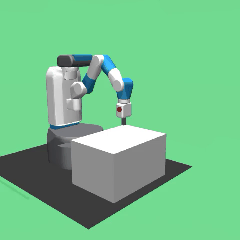
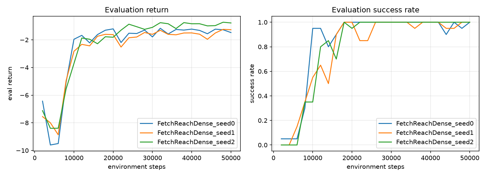

# SAC from scratch: Fetch reach

Soft Actor-Critic implemented from scratch in PyTorch, trained to make a
simulated Fetch robot arm reach randomly placed 3D targets (MuJoCo physics,
[Gymnasium-Robotics](https://robotics.farama.org/) `FetchReach`).

| Random policy | Trained policy |
| --- | --- |
|  |  |

## Task

Each episode the arm starts in a neutral pose and a target is sampled in 3D
space. The agent controls end-effector displacement (4 continuous actions: dx,
dy, dz, gripper) and is rewarded for moving the gripper toward the target. An
episode counts as a success if the gripper ends within 5 cm of the target.

The observation is goal-conditioned: the policy sees both the arm's state and
the target coordinates, so one network reaches any target rather than a fixed
one.

Targets are sampled a few cm above the tabletop. The default Fetch sampling box
dips slightly below the table surface, which made a small fraction of targets
spawn inside the table and the arm clip through it; flooring the target height
fixes that (see `MIN_GOAL_Z` in `train.py`).

## Algorithm

SAC ([Haarnoja et al. 2018](https://arxiv.org/abs/1801.01290)), the standard
off-policy algorithm for continuous control:

- **Actor**: tanh-squashed Gaussian policy over continuous actions.
- **Twin critics** with target networks (clipped double-Q) to counter Q-value
  overestimation.
- **Maximum-entropy objective** with an auto-tuned temperature, so the policy is
  rewarded for staying stochastic and explores on its own.
- **Replay buffer** for off-policy learning from past experience.

The algorithm is about 250 lines across `sac/buffer.py`, `sac/networks.py`, and
`sac/agent.py`, with no RL libraries.

## Results



All three seeds reach 100% evaluation success. Success climbs from around 10k
steps and is solid by 18k, with roughly 4.5 minutes of wall-clock per run on an
RTX 4090 laptop GPU (about 185 environment steps/sec). Final eval return lands
between -0.8 and -1.5: the gripper reaches the target within the first few steps
of each episode and holds position for the rest.

## Files

| File | What it does |
| --- | --- |
| `sac/` | The SAC agent: replay buffer, networks, update rules |
| `train.py` | Training loop, evaluation, logging |
| `plot.py` | Training curves from run logs |
| `record.py` | Record a video of a policy |
| `watch.py` | Watch a policy live in the MuJoCo viewer |

## Reproduce

```bash
source ../.venv/bin/activate       # shared env; see the top-level README for setup
python train.py                                     # ~50k steps
python plot.py runs/FetchReachDense_seed0/log.csv
python record.py runs/FetchReachDense_seed0/best.pt # video of trained arm
python record.py none --random                      # video of random policy
```
