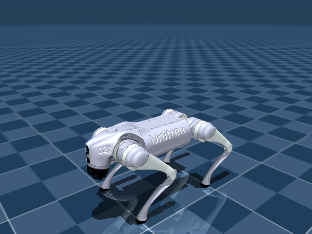

# Unitree Go2: quadruped locomotion (in progress)

Teaching a Unitree Go2 quadruped to walk at a commanded velocity in simulation
(MuJoCo), with PPO implemented from scratch in PyTorch and trained across many
parallel environments.

This is the ambitious project of the repo and is just getting started. The robot
model is vendored and stands in simulation; the environment, the PPO
implementation, and training come next.

## Why this setup

Legged locomotion is a real step up from the reaching tasks in `fetch_reach` and
`ur5e`. It needs a shaped, multi-term reward (track the velocity command, stay
upright, spend little energy, move smoothly), a fall-termination, and far more
experience to learn. So the plan follows how the field actually does it:

- **PPO from scratch**: the algorithm legged locomotion is built on (Isaac Lab
  and most sim-to-real work), and a new piece alongside the SAC in the other two
  projects.
- **Parallel environments**: many sims stepped at once, because a single
  environment cannot produce enough experience for locomotion in reasonable time.

## The robot

A free-floating base plus 12 leg joints (four legs, each with hip, thigh, and
calf), driven by 12 position actuators. A `home` keyframe sets a standing pose.
The model is vendored from
[MuJoCo Menagerie](https://github.com/google-deepmind/mujoco_menagerie) at a
pinned commit (see [`assets/PROVENANCE.md`](assets/PROVENANCE.md); regenerate
with [`assets/fetch_model.sh`](assets/fetch_model.sh)).

