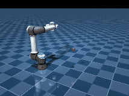
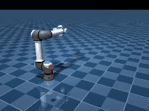
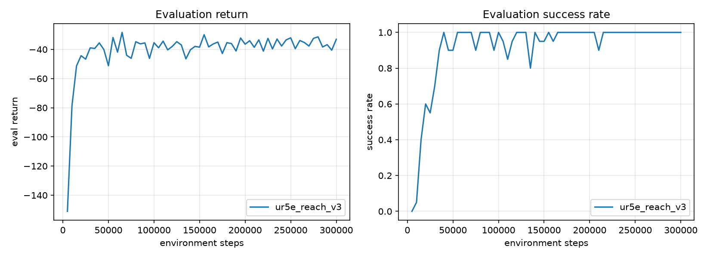

# UR5e: custom manipulation environment

A custom Gymnasium environment built from scratch around the Universal Robots
UR5e 6-DoF arm (MuJoCo physics), trained with the same from-scratch SAC agent as
the `fetch_reach` project. The arm learns to move its end-effector to a randomly
placed target: **100% success** over 100 evaluation episodes (reached and held),
mean final error 0.8 cm.

| Random policy | Trained policy |
| --- | --- |
|  |  |

The point of this project is the environment-design side of RL. In
`fetch_reach` the environment came prebuilt; here the observation space, action
space, reward, target sampling, and success criteria are all defined by hand
(`env.py`).

## Task

- **Observation (21)**: 6 joint positions, 6 joint velocities, the end-effector
  position, the target position, and the vector from hand to target. Each part
  is divided by a rough scale (`OBS_SCALE`) so all inputs are near unit size.
- **Action (6)**: a position change for each joint, so the agent controls the
  arm in joint space and has to learn the coordination itself. This is harder
  than FetchReach, which commands the hand directly in Cartesian space.
- **Reward**: negative distance from the end-effector to the target (dense).
- **Success**: end-effector within 5 cm of the target.

## Results



Over 100 evaluation episodes on a fixed seed: **100% reached** (within 5 cm at
some point) and **100% held** (still within 5 cm on the final step), mean closest
approach 0.8 cm. Training converges by about 100k steps.

This is a single seed, so treat it as a strong result rather than a guarantee:
100/100 gives a 95% lower confidence bound around 96%. A fuller evaluation would
report mean and spread over several seeds.

## The robot

6 revolute joints (base, shoulder, elbow, three wrist joints), each driven by a
position-controlled actuator. A `home` keyframe sets the starting pose, and the
wrist flange carries a site we treat as the end-effector. The model is vendored
from [MuJoCo Menagerie](https://github.com/google-deepmind/mujoco_menagerie) at a
pinned commit (see [`assets/PROVENANCE.md`](assets/PROVENANCE.md)).

## What it took (the honest version)

The first working policy took several tries, and the debugging is the useful
part:

1. Arm too slow and episodes too short, so it never reached in time (0%). Fixed
   by faster control and longer episodes.
2. It then reached the neighborhood but stalled a few cm short. A success bonus
   in the reward was meant to sharpen the final approach but did not help; a
   discontinuous reward tends to destabilize the critic. Reverted.
3. The real fix was **normalizing the observation**. The raw inputs ranged from
   joint angles in radians to positions in metres, and those mismatched scales
   made SAC train unstably. With the observation scaled to unit size (plus the
   hand-to-target vector in the observation), success went from a noisy plateau
   to a stable 100%.

The normalization here uses fixed per-component scales, which is simple and
worked; a running mean/std normalizer is the more general choice if the ranges
were not known ahead of time. Every step of the debugging came from measuring
behavior (per-step distance, success binned by target distance via `eval.py`),
not from guessing.

## Files

| File | What it does |
| --- | --- |
| `env.py` | The custom `UR5eReachEnv`: observation, action, reward, reset, step |
| `assets/` | Vendored UR5e model + `reach_scene.xml` (arm, floor, target) |
| `train.py` | Training loop (uses the SAC agent in `sac/`) |
| `eval.py` | Success rate over many episodes, binned by target distance |
| `watch.py` | Watch a policy live in the MuJoCo viewer |
| `record.py` | Record a video of a policy |
| `plot.py` | Training curves from a run log |

## Reproduce

```bash
source ../.venv/bin/activate       # shared env; see the top-level README for setup
python train.py --steps 300000 --run-name ur5e_reach_v3
python eval.py runs/ur5e_reach_v3/best.pt --episodes 100
MUJOCO_GL=egl python record.py runs/ur5e_reach_v3/best.pt
python watch.py runs/ur5e_reach_v3/best.pt   # live, needs a display
```
